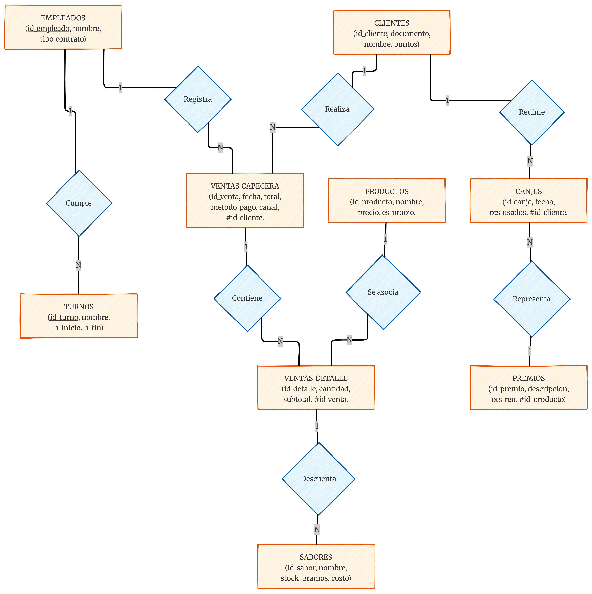
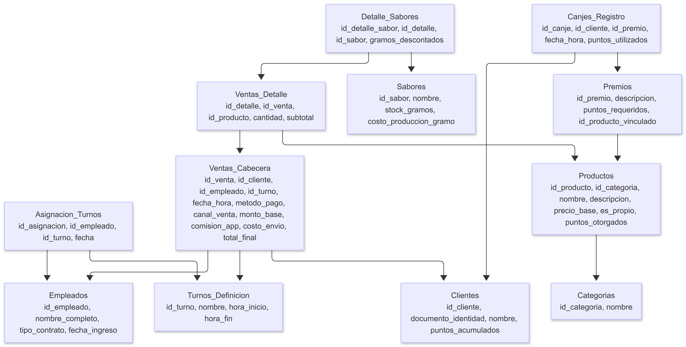

# Heladería "A tu Lado"

Repositorio oficial del proyecto **A tu Lado**, una solución tecnológica diseñada para la administración eficiente de una heladería artesanal con un modelo de negocio híbrido. Este sistema integra la gestión de inventarios pesados, ventas multicanal y fidelización de clientes.

## Visión General
El proyecto nace de la necesidad de modernizar el control de stock y ventas en el sector heladero, donde conviven productos por unidad (comerciales) y productos por peso (artesanales). "A tu Lado" no solo procesa transacciones, sino que optimiza la relación con el cliente y la logística de personal.

## Características Principales

### Gestión de Inventario Híbrido
*   **Productos Artesanales:** Control de stock basado en gramos para helados propios, permitiendo un descuento preciso de inventario por cada bola de helado servida.
*   **Productos Comerciales:** Soporte para inventario de proveedores externos (Delizia, Pil, etc.) gestionado por unidades físicas.
*   **Gestión de Toppings:** Control independiente de extras y salsas que complementan la experiencia del usuario.

### Logística de Ventas y Delivery
*   **Venta Omnicanal:** Registro diferenciado para ventas en mostrador y pedidos a través de plataformas externas (Yango, PedidosYa).
*   **Arquitectura de Precios:** Desglose técnico de costos, separando el precio base del producto, las comisiones de plataforma y los costos de envío.
*   **Múltiples Métodos de Pago:** Soporte integrado para transacciones en efectivo y tarjetas.

### Programa de Fidelización "Puntos A tu Lado"
*   **Sistema de Recompensas:** Los clientes acumulan puntos basados en sus consumos, los cuales pueden ser canjeados por productos del catálogo de premios.
*   **Módulo de Canje Independiente:** Los premios se gestionan en un flujo separado para mantener la transparencia en los reportes financieros de ventas netas.

### Administración de Talento Humano
*   **Gestión por Turnos:** Estructura operativa dividida en tres bloques:
    *   Mañana: 08:00 - 12:00
    *   Tarde: 14:30 - 18:30
    *   Noche: 18:30 - 22:30
*   **Asignación Flexible:** Capacidad de registrar dependientes en modalidades de medio tiempo o tiempo completo (doble turno).

## Arquitectura Técnica (Preview)

El sistema se fundamenta en una base de datos relacional diseñada para garantizar la integridad referencial y la trazabilidad de cada gramo de producto.

*   **Modelado:** Diagrama Entidad-Relación (DER) con normalización en 3FN.
*   **Documentación:** Mermaid.js para diagramas de flujo y esquemas de tablas.

**Tecnologías:**
*   **Motor de DB:** PostgreSQL

## Estructura del Proyecto

*   `/docs`: Contiene el relevamiento detallado y requisitos de software.
*   `/sql`: Scripts de creación de base de datos, vistas y procedimientos almacenados.
*   `/src`: Código fuente de la interfaz o API de conexión.

## Esquema de la base de datos
### 1. Módulo de Productos e Inventario

Esta sección separa la definición del producto de su stock físico para permitir flexibilidad.

**Tabla: Categorias**

* id_categoria (INT, PK, AI)
* nombre (VARCHAR): Ej. 'Artesanal', 'Comercial', 'Topping', 'Bebida'.

**Tabla: Productos**

* id_producto (INT, PK, AI)
* id_categoria (FK)
* nombre (VARCHAR)
* descripcion (TEXT)
* precio_base (DECIMAL 10,2): Precio de venta al público.
* es_propio (BOOLEAN): Define si es artesanal (se mide en gramos) o comercial (unidades).
* puntos_otorgados (INT): Cuántos puntos suma esta compra al cliente.

**Tabla: Sabores**

* id_sabor (INT, PK, AI)
* nombre (VARCHAR): Ej. 'Chocolate Amargo', 'Frutilla al Agua'.
* stock_gramos (DECIMAL 10,2): Cantidad actual en el contenedor.
* costo_produccion_gramo (DECIMAL 10,4): Para calcular rentabilidad.

### 2. Módulo de Personal y Turnos

**Tabla: Empleados**

* id_empleado (INT, PK, AI)
* nombre_completo (VARCHAR)
* tipo_contrato (ENUM): 'Medio Tiempo', 'Tiempo Completo'.
* fecha_ingreso (DATE)

**Tabla: Turnos_Definicion**

* id_turno (INT, PK, AI)
* nombre (VARCHAR): 'Mañana', 'Tarde', 'Noche'.
* hora_inicio (TIME)
* hora_fin (TIME)

**Tabla: Asignacion_Turnos**

* id_asignacion (INT, PK, AI)
* id_empleado (FK)
* id_turno (FK)
* fecha (DATE)

### 3. Módulo de Clientes y Fidelización

**Tabla: Clientes**

* id_cliente (INT, PK, AI)
* documento_identidad (VARCHAR, Unique): CI o NIT.
* nombre (VARCHAR)
* puntos_acumulados (INT)

**Tabla: Premios**

* id_premio (INT, PK, AI)
* descripcion (VARCHAR)
* puntos_requeridos (INT)
* id_producto_vinculado (FK): Para saber qué descontar del inventario al canjearlo.

### 4. Módulo de Ventas y Delivery

**Tabla: Ventas_Cabecera**

* id_venta (INT, PK, AI)
* id_cliente (FK, Nullable): Null si es cliente ocasional.
* id_empleado (FK): Quién realizó la venta.
* id_turno (FK): Turno en el que se realizó (para arqueo).
* fecha_hora (DATETIME)
* metodo_pago (ENUM): 'Efectivo', 'Tarjeta'.
* canal_venta (ENUM): 'Local', 'Yango', 'PedidosYa'.

**Campos de Delivery:**

* monto_base (DECIMAL 10,2)
* comision_app (DECIMAL 10,2)
* costo_envio (DECIMAL 10,2)
* total_final (DECIMAL 10,2)

**Tabla: Ventas_Detalle**

* id_detalle (INT, PK, AI)
* id_venta (FK)
* id_producto (FK)
* cantidad (INT): Cantidad de unidades o envases.
* subtotal (DECIMAL 10,2)

**Tabla: Detalle_Sabores (Relación Muchos a Muchos para helados propios)**

* id_detalle_sabor (INT, PK, AI)
* id_detalle (FK): Vincula a la línea del producto (ej. el "Vaso Doble").
* id_sabor (FK)
* gramos_descontados (DECIMAL 10,2): Ej. 75.00.

### 5. Módulo de Canjes (Premios)

**Tabla: Canjes_Registro**

* id_canje (INT, PK, AI)
* id_cliente (FK)
* id_premio (FK)
* fecha_hora (DATETIME)
* puntos_utilizados (INT)

## Diagrama

  

## Mapeado

  

