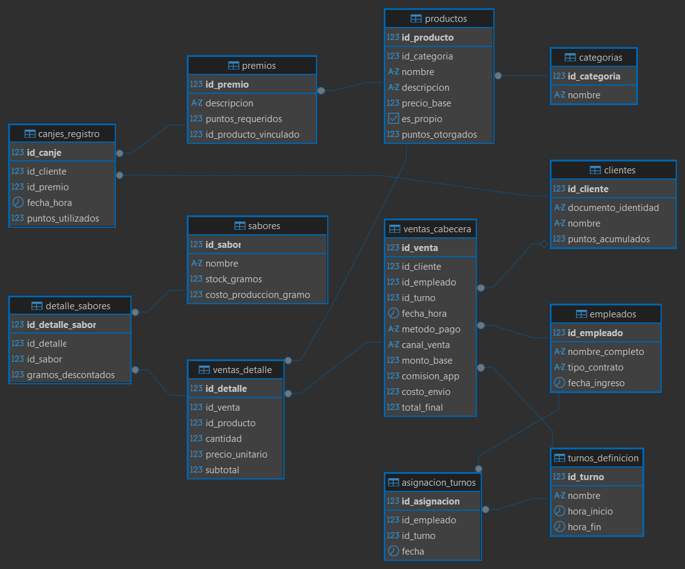

# 🍦 Heladería "A tu Lado"

Repositorio oficial del proyecto **A tu Lado**, una solución tecnológica diseñada para la administración eficiente de una heladería artesanal con un modelo de negocio híbrido. Este sistema integra la gestión detallada de inventarios de producción propia, ventas multicanal y fidelización de clientes.

## Visión General
El proyecto nace de la necesidad de modernizar el control de stock y ventas en el sector heladero. "A tu Lado" no solo procesa transacciones, sino que optimiza la relación con el cliente, proporciona herramientas de auditoría sobre el personal y maneja un sistema de inventario basado en el peso de los ingredientes, permitiendo un control exacto de la rentabilidad.

## Características Principales

### Gestión de Inventario Híbrido
*   **Producción Propia (Artesanal):** Control de stock estricto basado en gramos. Cada sabor se monitorea individualmente, permitiendo un descuento exacto del inventario (`gramos_descontados`) por cada producto servido.
*   **Productos Comerciales:** Soporte para ítems preenvasados gestionados mediante unidades físicas en el registro de ventas (sin control de stock físico en esta iteración, pero separados lógicamente mediante la bandera `es_propio`).

### 🛵 Logística de Ventas y Delivery
*   **Venta Omnicanal:** Registro diferenciado para ventas a través del canal 'Local' o mediante plataformas externas de delivery ('Yango', 'PedidosYa').
*   **Arquitectura de Precios Desglosada:** Separación técnica de los ingresos reales: monto base del producto, comisiones retenidas por plataformas y los costos de envío.
*   **Múltiples Métodos de Pago:** Soporte integrado para cierres de caja en 'Efectivo' o 'Tarjeta'.

### 🎁 Programa de Fidelización "Puntos A tu Lado"
*   **Sistema de Recompensas por Producto:** La acumulación de puntos está atada al valor configurado en cada producto (`puntos_otorgados`), lo que permite realizar campañas de marketing focalizadas.
*   **Módulo de Canje Independiente:** Los premios se gestionan en un flujo separado (`Canjes_Registro`) para mantener la integridad y transparencia en los reportes financieros de ventas netas.

### 👨‍💼 Administración y Auditoría de Personal
*   **Estructura de Turnos:** Soporte para definir los bloques horarios operativos (ej. Mañana, Tarde, Noche) validando que la jornada tenga congruencia temporal.
*   **Asignación Dinámica:** Capacidad de registrar qué empleado cubre qué turno cada día específico (`fecha`).
*   **Trazabilidad Financiera:** Cada transacción de venta está rígidamente vinculada tanto al vendedor como al turno activo, previniendo descuadres y mejorando la rendición de cuentas.

## Arquitectura Técnica (Preview)

El sistema se fundamenta en una base de datos relacional diseñada para garantizar la integridad referencial y la trazabilidad de las operaciones.

*   **Modelado:** Diagrama Entidad-Relación Extendido (EER).
*   **Tipos Personalizados:** Uso exhaustivo de `ENUMS` nativos en base de datos para restringir dominios.
*   **Documentación:** Uso de Mermaid.js para diagramación "As-Code".

## Arquitectura del sistema
* Backend: Node.js + Express.js
* Base de Datos: PostgreSQL
* Frontend: HTML5, CSS3 (Vanilla), JavaScript (Vanilla)
* Librerías clave: 
    * html2pdf.js (Generación de Facturas PDF)
    * Morgan (Logging de servidor)
    * CORS (Seguridad de peticiones)

# 👨‍💻 Tecnologías Utilizadas

| Tecnología | Descripción |
|:---:|:---:|
| PostgreSQL | Sistema gestor de base de datos relacional |
| Node.js | Entorno de ejecución para JavaScript del lado del servidor |
| Express.js | Framework backend para APIs y rutas |
| HTML5 | Estructura de interfaces web |
| CSS3 | Diseño y estilos visuales |
| JavaScript (Vanilla) | Lógica e interacción del frontend |
| SQL | Lenguaje de consultas para la base de datos |
| Mermaid.js | Diagramación y documentación visual |
| Git | Control de versiones |
| GitHub | Repositorio y colaboración del proyecto |
| html2pdf.js | Generación de facturas en formato PDF |
| Morgan | Logging y monitoreo de peticiones del servidor |
| CORS | Seguridad y control de solicitudes HTTP |

---
# 📋 Reglas de Negocio

Las siguientes reglas definen el comportamiento y las restricciones funcionales del sistema de gestión de la heladería **A tu Lado**. Estas reglas garantizan la integridad de los datos, la trazabilidad de operaciones y el correcto funcionamiento de cada módulo del sistema.

---

## 🍨 Módulo de Productos e Inventario

1. Cada producto debe pertenecer obligatoriamente a una categoría.

2. Un sabor no puede tener nombres duplicados dentro del sistema.

3. Los productos artesanales (`es_propio = TRUE`) deben descontar automáticamente stock en gramos.

4. Los productos comerciales (`es_propio = FALSE`) no afectan el inventario artesanal.

5. El stock de sabores nunca puede ser negativo.

6. El costo de producción por gramo debe ser mayor a cero.

7. Cada producto puede otorgar una cantidad específica de puntos al cliente.

8. Un producto no puede tener un precio menor o igual a cero.

9. Todo sabor debe registrar existencias iniciales antes de ser utilizado en ventas.

10. Los descuentos de inventario deben registrarse mediante la tabla `detalle_sabores`.

---

## 👨‍💼 Módulo de Personal y Turnos

11. Cada empleado debe tener un tipo de contrato válido.

12. Un empleado no puede tener dos turnos asignados en la misma fecha y horario.

13. La hora de inicio de un turno debe ser menor a la hora de finalización.

14. Toda asignación de turno debe estar asociada a un empleado existente.

15. Toda venta debe estar relacionada con un empleado responsable.

16. Los turnos deben mantenerse activos únicamente dentro de horarios válidos.

17. Cada empleado debe tener una fecha de ingreso registrada.

18. No se permite registrar ventas sin un turno asociado.

---

## 🛵 Módulo de Ventas y Delivery

19. Toda venta debe registrar:
- método de pago
- canal de venta
- fecha y hora

20. Una venta debe tener al menos un detalle de producto.

21. El subtotal de cada detalle se calcula mediante:

subtotal = cantidad × precio_unitario

22. El total final de la venta debe considerar:
- monto base
- comisión de aplicaciones
- costo de envío

23. El total final nunca puede ser negativo.

24. Las ventas delivery pueden registrar comisión de aplicación.

25. Las ventas locales no deben generar comisión de aplicación.

26. El método de pago solo puede ser:
- Efectivo
- Tarjeta

27. El canal de venta solo puede ser:
- Local
- Yango
- PedidosYa

28. Toda venta debe registrar un empleado y un turno válido.

29. Los productos vendidos deben existir previamente en el sistema.

30. El subtotal de la venta debe coincidir con la suma de sus detalles.

---

## 🎁 Módulo de Fidelización

31. Un cliente puede acumular puntos mediante compras.

32. Los puntos acumulados nunca pueden ser negativos.

33. Un cliente solo puede canjear premios si posee los puntos necesarios.

34. Todo canje debe quedar registrado en el historial.

35. Los puntos utilizados en un canje deben descontarse automáticamente.

36. Cada premio debe tener una cantidad mínima de puntos requeridos.

37. Los premios pueden estar asociados a productos específicos.

38. Un cliente puede realizar múltiples canjes mientras disponga de puntos suficientes.

---

## 🔐 Reglas Generales del Sistema

39. Todas las tablas deben tener clave primaria.

40. Las relaciones entre módulos deben mantener integridad referencial.

41. No se permiten registros huérfanos en tablas relacionadas.

42. El sistema debe mantener trazabilidad de:
- ventas
- empleados
- turnos
- clientes

43. Toda operación debe registrar fecha y hora cuando corresponda.

44. Los identificadores principales deben ser únicos.

45. El sistema debe evitar duplicidad de información mediante normalización de datos.

46. Toda clave foránea debe referenciar un registro existente.

47. Los datos críticos del sistema no deben ser eliminados físicamente sin control administrativo.

48. El sistema debe garantizar consistencia entre inventario, ventas y fidelización.

---

## 📂 Estructura del Proyecto

*   `/docs`: Contiene el relevamiento detallado, requisitos de software y diagramas en formato Markdown/Mermaid.
*   `/sql`: Scripts de creación de base de datos (`DDL`), definiciones de tipos y constraints.
*   `/src`: Código fuente de la interfaz o API de conexión.
  
---

## 🗄️ Esquema de la Base de Datos Físico

El diseño de la base de datos se divide en módulos funcionales:

### 1. Módulo de Productos e Inventario

**Tabla: `categorias`**
| Atributo     | Tipo    | Restricción      | Descripción                         |
| ------------ | ------- | ---------------- | ----------------------------------- |
| id_categoria | SERIAL  | PK               | Identificador único de la categoría |
| nombre       | VARCHAR | UNIQUE, NOT NULL | Nombre de la categoría              |

**Tabla: `productos`**
| Atributo         | Tipo          | Restricción  | Descripción                                    |
| ---------------- | ------------- | ------------ | ---------------------------------------------- |
| id_producto      | SERIAL        | PK           | Identificador único del producto               |
| id_categoria     | INT           | FK, NOT NULL | Categoría asociada                             |
| nombre           | VARCHAR       | NOT NULL     | Nombre del producto                            |
| descripcion      | TEXT          | NULL         | Descripción detallada                          |
| precio_base      | NUMERIC(10,2) | NOT NULL     | Precio base del producto                       |
| es_propio        | BOOLEAN       | NOT NULL     | Define si el producto es artesanal o comercial |
| puntos_otorgados | INT           | DEFAULT 0    | Puntos otorgados al cliente                    |

**Tabla: `sabores`**
| Atributo               | Tipo          | Restricción      | Descripción                   |
| ---------------------- | ------------- | ---------------- | ----------------------------- |
| id_sabor               | SERIAL        | PK               | Identificador del sabor       |
| nombre                 | VARCHAR       | UNIQUE, NOT NULL | Nombre del sabor              |
| stock_gramos           | NUMERIC(12,2) | NOT NULL         | Cantidad disponible en gramos |
| costo_produccion_gramo | NUMERIC(10,4) | NOT NULL         | Costo de producción por gramo |

### 2. Módulo de Personal y Turnos

**Tipos:** `tipo_contrato_enum` ('Medio Tiempo', 'Tiempo Completo')

**Tabla: `empleados`**
| Atributo        | Tipo               | Restricción | Descripción                  |
| --------------- | ------------------ | ----------- | ---------------------------- |
| id_empleado     | SERIAL             | PK          | Identificador del empleado   |
| nombre_completo | VARCHAR            | NOT NULL    | Nombre completo del empleado |
| tipo_contrato   | tipo_contrato_enum | NOT NULL    | Tipo de contrato             |
| fecha_ingreso   | DATE               | NOT NULL    | Fecha de ingreso             |

**Tabla: `turnos_definicion`**
| Atributo    | Tipo    | Restricción | Descripción             |
| ----------- | ------- | ----------- | ----------------------- |
| id_turno    | SERIAL  | PK          | Identificador del turno |
| nombre      | VARCHAR | NOT NULL    | Nombre del turno        |
| hora_inicio | TIME    | NOT NULL    | Hora de inicio          |
| hora_fin    | TIME    | NOT NULL    | Hora de finalización    |

**Tabla: `asignacion_turnos`**
| Atributo      | Tipo   | Restricción  | Descripción                 |
| ------------- | ------ | ------------ | --------------------------- |
| id_asignacion | SERIAL | PK           | Identificador de asignación |
| id_empleado   | INT    | FK, NOT NULL | Empleado asignado           |
| id_turno      | INT    | FK, NOT NULL | Turno correspondiente       |
| fecha         | DATE   | NOT NULL     | Fecha de asignación         |

### 3. Módulo de Clientes y Fidelización

**Tabla: `clientes`**
| Atributo            | Tipo    | Restricción | Descripción                 |
| ------------------- | ------- | ----------- | --------------------------- |
| id_cliente          | SERIAL  | PK          | Identificador del cliente   |
| documento_identidad | VARCHAR | UNIQUE      | Documento del cliente       |
| nombre              | VARCHAR | NOT NULL    | Nombre completo             |
| puntos_acumulados   | INT     | DEFAULT 0   | Total de puntos disponibles |

**Tabla: `premios`**
| Atributo              | Tipo    | Restricción | Descripción                    |
| --------------------- | ------- | ----------- | ------------------------------ |
| id_premio             | SERIAL  | PK          | Identificador del premio       |
| descripcion           | VARCHAR | NOT NULL    | Descripción del premio         |
| puntos_requeridos     | INT     | NOT NULL    | Puntos necesarios para canjear |
| id_producto_vinculado | INT     | FK          | Producto relacionado           |

### 4. Módulo de Ventas y Delivery

**Tipos:** `metodo_pago_enum` ('Efectivo', 'Tarjeta'), `canal_venta_enum` ('Local', 'Yango', 'PedidosYa')

**Tabla: `ventas_cabecera`**
| Atributo     | Tipo             | Restricción  | Descripción             |
| ------------ | ---------------- | ------------ | ----------------------- |
| id_venta     | SERIAL           | PK           | Identificador de venta  |
| id_cliente   | INT              | FK, NULL     | Cliente asociado        |
| id_empleado  | INT              | FK, NOT NULL | Empleado responsable    |
| id_turno     | INT              | FK, NOT NULL | Turno activo            |
| fecha_hora   | TIMESTAMP        | NOT NULL     | Fecha y hora de venta   |
| metodo_pago  | metodo_pago_enum | NOT NULL     | Método de pago          |
| canal_venta  | canal_venta_enum | NOT NULL     | Canal utilizado         |
| monto_base   | NUMERIC(10,2)    | NOT NULL     | Valor base de productos |
| comision_app | NUMERIC(10,2)    | DEFAULT 0    | Comisión de plataforma  |
| costo_envio  | NUMERIC(10,2)    | DEFAULT 0    | Costo de delivery       |
| total_final  | NUMERIC(10,2)    | NOT NULL     | Total pagado            |

**Tabla: `ventas_detalle`**
| Atributo        | Tipo          | Restricción  | Descripción               |
| --------------- | ------------- | ------------ | ------------------------- |
| id_detalle      | SERIAL        | PK           | Identificador del detalle |
| id_venta        | INT           | FK, NOT NULL | Venta relacionada         |
| id_producto     | INT           | FK, NOT NULL | Producto vendido          |
| cantidad        | INT           | NOT NULL     | Cantidad vendida          |
| precio_unitario | NUMERIC(10,2) | NOT NULL     | Precio por unidad         |
| subtotal        | NUMERIC(10,2) | NOT NULL     | Subtotal calculado        |

**Tabla: `detalle_sabores`**
| Atributo           | Tipo          | Restricción  | Descripción         |
| ------------------ | ------------- | ------------ | ------------------- |
| id_detalle_sabor   | SERIAL        | PK           | Identificador       |
| id_detalle         | INT           | FK, NOT NULL | Detalle relacionado |
| id_sabor           | INT           | FK, NOT NULL | Sabor utilizado     |
| gramos_descontados | NUMERIC(10,2) | NOT NULL     | Cantidad descontada |

### 5. Módulo de Canjes (Premios)

**Tabla: `canjes_registro`**
| Atributo          | Tipo      | Restricción  | Descripción                  |
| ----------------- | --------- | ------------ | ---------------------------- |
| id_canje          | SERIAL    | PK           | Identificador del canje      |
| id_cliente        | INT       | FK, NOT NULL | Cliente que realiza el canje |
| id_premio         | INT       | FK, NOT NULL | Premio solicitado            |
| fecha_hora        | TIMESTAMP | NOT NULL     | Fecha y hora del canje       |
| puntos_utilizados | INT       | NOT NULL     | Puntos consumidos            |

---
### 🔐 Características de Integridad
* Integridad referencial mediante claves foráneas.
* Uso de restricciones NOT NULL.
* Validaciones con ENUM.
* Diseño normalizado.
* Control de trazabilidad de operaciones.
* Separación lógica de módulos funcionales.
## Diagramas

  

  

